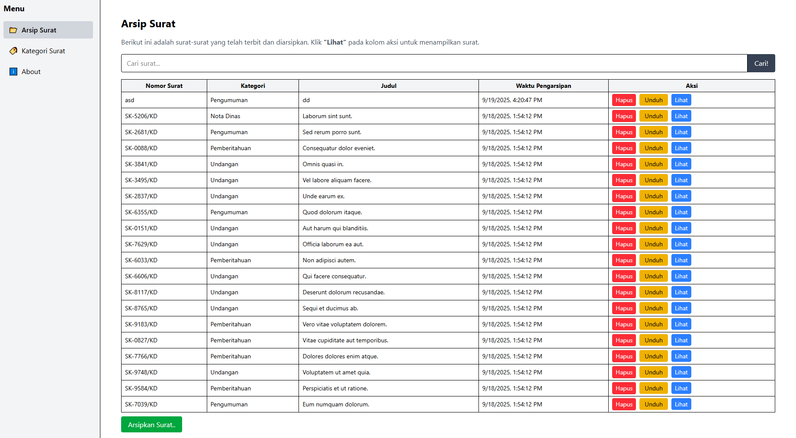
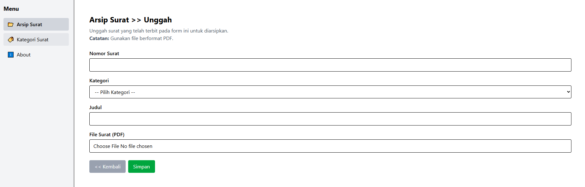
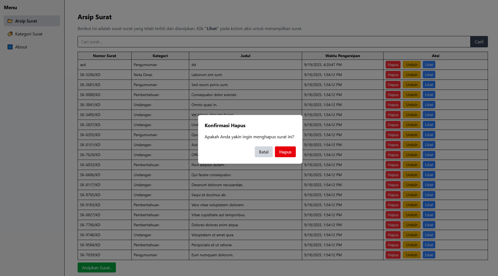
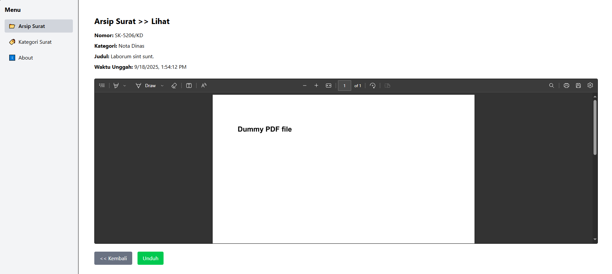
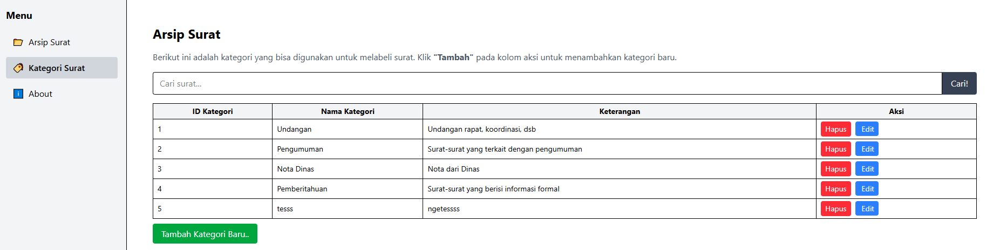
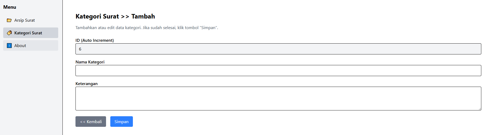
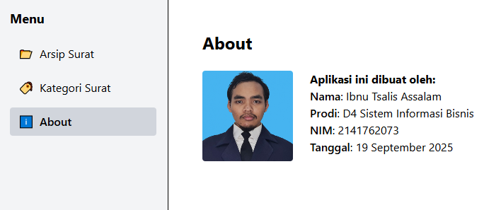

# 📑 Arsip Surat – Desa Karangduren

## 🎯 Tujuan
Aplikasi ini dibuat untuk membantu perangkat Desa Karangduren dalam **mengarsipkan surat resmi**.  
Setiap surat yang telah diterbitkan oleh perangkat desa akan dipindai ke format PDF, lalu diunggah ke sistem. Dengan aplikasi ini, pengguna dapat menyimpan, mencari, melihat, mengunduh, dan mengelola arsip surat dengan lebih mudah dan terstruktur.

---

## ✨ Fitur
1. **Halaman Utama (Arsip Surat)**
   - Mencari surat berdasarkan judul melalui search bar.  
   - Mengunggah surat baru melalui tombol **"Arsipkan Surat.."**.  
   - Menghapus surat dengan konfirmasi (modal).  
   - Mengunduh file surat dalam format PDF.  
   - Melihat detail surat dengan tombol **"Lihat"**.  
   - Navigasi ke halaman **About**.  

2. **Tambah / Edit Arsip Surat**
   - Input nomor surat, judul, kategori, dan upload file PDF.  
   - Kategori surat tersedia dalam pilihan: `Undangan`, `Pengumuman`, `Nota Dinas`, dan `Pemberitahuan`.  
   - Validasi upload: hanya menerima file PDF.  
   - Pesan “Data berhasil disimpan” ketika berhasil menambah data.  

3. **Konfirmasi Hapus Surat**
   - Ketika tombol **Hapus** ditekan, muncul modal peringatan.  

4. **Detail Surat**
   - Menampilkan informasi lengkap: nomor surat, kategori, judul, waktu unggah.  
   - Preview file PDF di dalam iframe.  

5. **Manajemen Kategori Surat**
   - Daftar semua kategori surat dengan tabel.  
   - Tombol **Tambah**, **Edit**, dan **Hapus** untuk mengelola kategori.  

6. **Tambah / Edit Kategori**
   - Form tambah kategori baru atau edit kategori yang sudah ada.  
   - ID kategori otomatis (auto increment).  
   - Tombol **Simpan** untuk menyimpan perubahan, **Kembali** untuk kembali ke daftar kategori.  

7. **Halaman About**
   - Menampilkan foto profil, nama pembuat aplikasi, NIM, dan tanggal pembuatan aplikasi.  

---

## 🚀 Cara Menjalankan
1. **Clone repository**
    ```bash
    git clone https://github.com/username/document-archive.git
    cd document-archive
    ```
2. **Install dependencies**
    ```bash
    composer install
    npm install
    ```
3. **Copy ```.env``` file**
    ```bash
    cp .env.example .env
    php artisan key:generate
    ```
4. **Atur database**
    - Buka file ```.env```, sesuaikan pengaturan database (```DB_DATABASE```, ```DB_USERNAME```, ```DB_PASSWORD```).
    - Jalankan migrasi:
        ```bash
        php artisan migrate --seed
        ```
5. **Jalankan server**
    - Backend (Laravel):
        ```bash
        php artisan serve
        ```
    - Frontend (Vite):
        ```bash
        npm run dev
        ```
6. **Akses aplikasi**

    Buka browser ke http://127.0.0.1:8000

---

## 📝 Langkah Kerja

1. **Halaman Utama Arsip Surat**

    - Terdapat kolom **Cari Surat..** untuk mencari surat berdasarkan judul.
    - Tombol **Cari** akan memfilter tabel hanya menampilkan data surat yang sesuai.
    - Tombol **Arsipkan Surat..** membuka halaman tambah surat baru.
    - Tombol **Hapus** menampilkan modal konfirmasi sebelum menghapus data.
    - Tombol **Unduh** untuk mengunduh file PDF surat.
    - Tombol **Lihat** membuka detail surat.
    - Menu About membuka halaman profil pembuat aplikasi.

2. **Tambah Surat**

    - Form input terdiri dari nomor surat, judul, kategori, dan upload file PDF.
    - Kategori berupa combobox dengan pilihan Undangan, Pengumuman, Nota Dinas, Pemberitahuan.
    - Tombol **Simpan** akan menyimpan ke database dan menampilkan notifikasi sukses.
    - Tombol **Kembali** akan membawa pengguna ke halaman utama.

3. **Konfirmasi Hapus**

    - Ketika klik Hapus, muncul modal konfirmasi.
    - Jika klik **Hapus**, data akan dihapus dari database dan tabel.
    - Jika klik **Batal**, modal ditutup tanpa perubahan.

4. **Detail Surat**

    - Menampilkan detail surat termasuk nomor, judul, kategori, waktu upload.
    - Menyediakan preview file PDF di layar.
    - Tombol **Kembali** untuk kembali ke halaman utama.
    - Tombol **Unduh** untuk mengunduh file PDF.

5. **Manajemen Kategori**

    - Halaman daftar kategori dengan tabel.
    - Tersedia tombol Tambah, Edit, dan Hapus.
    - Langkah mirip dengan fitur Arsip Surat.

6. **Tambah / Edit Kategori**

    - Jika dari tombol Tambah, form kosong untuk membuat kategori baru.
    - Jika dari tombol Edit, form terisi data kategori yang dipilih.
    - ID kategori otomatis (auto increment).
    - Tombol **Simpan** menyimpan data baru / update data lama.
    - Tombol **Kembali** untuk kembali ke halaman daftar kategori.

7. **Halaman About**

    - Menampilkan foto profil pembuat aplikasi.
    - Menampilkan nama, NIM, dan tanggal pembuatan aplikasi.
